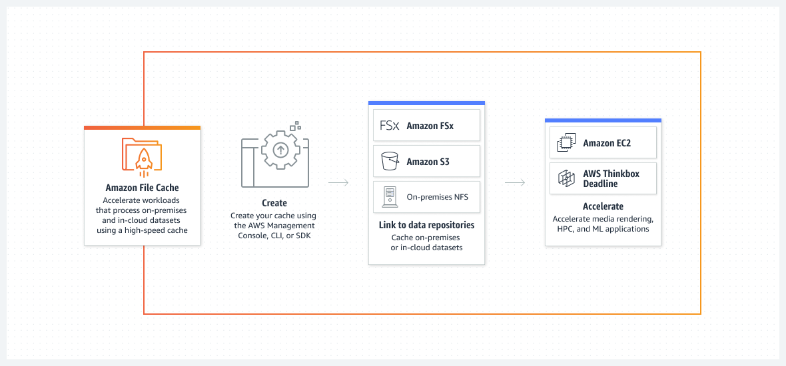

# ***AWS Certified Solutions Architect [SAA - C03]*** #

# AWS Management #

## AWS Organizations ##
Is an account management service that enables you to consolidate multiple AWS accounts into an organization that you create and centrally manage. 

Includes account management and consolidated billing capabilities that enable you to better meet the budgetary, security, and compliance needs of your business.

As an administrator of an organization, you can create accounts in your organization and invite existing accounts to join the organization.

### Organization Unit ###
- Is a container of AWS accounts within a root of an organization.
- Policies that are attached to an OU apply to all accounts contained in that OU and in any child OUs.

## AWS Secrets Manager ##
- Is a secrets management service that helps you protect access to your applications, services, and IT resources
- Used for credentials.

### IAM Role ###
- Could be used to grant access to an EC2 Intance.
- Are not directly attached to IAM groups.
  
### IAM policies ###
You can't specify the principal in an identity-based policy because it applies to the user or role to which it is attached
Can be directly attached to IAM groups too.

### Principal OrgID ###
- Validates if the principal accessing the resource is within your organization.
---

# AWS Networking #

## VPC (Amazon virtual Cloud) ##
Allows you to launch AWS resources in a logically isolated virtual network that you've defined.

This virtual network closely resembles a traditional network that you'd operate in your own data center, with the benefits of using the scalable infrastructure of AWS.

### VPC Endpoints ###
- Allows to connect to AWS services using a private network instead using the public internet.
- Enables you to privately access AWS services without requiring internet gateways, NAT gateways, VPN connections, or AWS Direct Connect connections.
- Allows you to connect your VPC directly to supported AWS services, such as Amazon S3, over a private connection within the AWS network.

## VPC and subnets overview ##
The following diagram provides an overview of the resources included in this example. The VPC has public subnets and private subnets in two Availability Zones. Each public subnet contains a NAT gateway and a load balancer node. The servers run in the private subnets, are launched and terminated by using an Auto Scaling group, and receive traffic from the load balancer. The servers can connect to the internet by using the NAT gateway. The servers can connect to Amazon S3 by using a gateway VPC endpoint.

## Virtual private gateway ##
A virtual private gateway is the VPN endpoint on the Amazon side of your Site-to-Site VPN connection that can be attached to a single VPC

---

# AWS Storage Services #
Storage as a Service (StaaS) is a way for organizations to manage storage capacity and workloads without the overhead costs of upfront capital for storage hardware and software or staff time

## Amazon Simple Storage Service (S3) ##
An object storage service offering industry-leading scalability, data availability, security, and performance. Customers of all sizes and industries can store and protect any amount of data for virtually any use case, such as data lakes, cloud-native applications, and mobile apps. With cost-effective storage classes and easy-to-use management features, you can optimize costs, organize data, and configure fine-tuned access controls to meet specific business, organizational, and compliance requirements.

### S3 Transfer Acceleration ###
- Good for high speed
- Designed to optimize transfer speeds from across the world into S3 buckets.

###  S3 Lifecycle configuration ###
Is a set of rules that define actions that Amazon S3 applies to a group of objects. There are two types of actions:

### S3 Standard-Infrequent Access ###
Is for data that is accessed less frequently, but requires rapid access when needed. S3 Standard-IA offers the high durability, high throughput, and low latency of S3 Standard, with a low per GB storage price and per GB retrieval charge.

### S3 Intelligent-Tiering ###
- Amazon S3 Intelligent Tiering is a storage class that automatically moves data to the most cost-effective storage tier based on access patterns. It can store objects in two access tiers: the frequent access tier and the infrequent access tier. The frequent access tier is optimized for frequently accessed objects and is charged at the same rate as S3 Standard. The infrequent access tier is optimized for objects that are not accessed frequently and are charged at a lower rate than S3 Standard.
- S3 Intelligent Tiering is a good choice for storing media files that are accessed frequently and infrequently in an unpredictable pattern because it automatically moves data to the most cost-effective storage tier based on access patterns, minimizing storage and retrieval costs. It is also resilient to the loss of an Availability Zone because it stores objects in multiple Availability Zones within a region.

### Amazon S3 Glacier Deep Archive ###
- Is a secure, durable, and extremely low-cost Amazon S3 storage class for long-term retention of data that is rarely accessed and for which retrieval times of several hours are acceptable. It is the lowest-cost storage option in Amazon S3, making it a cost-effective choice for storing backup files that are not accessed after 1 month.
- 
### S3 File Gateway ###
- Provides a seamless way to connect to the cloud in order to store application data files and backup images as durable objects in Amazon S3 cloud storage. Amazon S3 File Gateway offers SMB or NFS-based access to data in Amazon S3 with local caching.

## Amazon Elastic File System (EFS) ##
- Serverless, fully elastic file storage
- Automatically grows and shrinks as you add and remove files with no need for management or provisioning.
- Amazon EFS provides shared access to data using a traditional file sharing permissions model and hierarchical directory structure via the NFSv4 protocol. Applications that access data using a standard file system interface provided through the operating system can use Amazon EFS to take advantage of the scalability and reliability of file storage in the cloud without writing any new code or adjusting applications.
- Hierarchical directory structure, read and write rapidly and concurrently to shared storage
- Store files without server
- Pay just for the storage.
- Support cross Availability zones.
- Cheap than EBS
- Expensive than S3

## AWS Action ##

### Transition actions ###
- These actions define when objects transition to another storage class. For example, you might choose to transition objects to the S3 Standard-IA storage class 30 days after creating them, or archive objects to the S3 Glacier Flexible Retrieval storage class one year after creating them. For more information, see Using Amazon S3 storage classes.

- There are costs associated with lifecycle transition requests. For pricing information, see Amazon S3 pricing.

### Expiration actions ###
- These actions define when objects expire. Amazon S3 deletes expired objects on your behalf.
- Lifecycle expiration costs depend on when you choose to expire objects. For more information, see Expiring objects.
- 
## Amazon FSX ##
Amazon FSx makes it easy and cost effective to launch, run, and scale feature-rich, high-performance file systems in the cloud. It supports a wide range of workloads with its reliability, security, scalability, and broad set of capabilities. Amazon FSx is built on the latest AWS compute, networking, and disk technologies to provide high performance and lower TCO. And as a fully managed service, it handles hardware provisioning, patching, and backups -- freeing you up to focus on your applications, your end users, and your business.

You can choose between four widely-used file systems: NetApp ONTAP, OpenZFS, Windows File Server, and Lustre.

### Amazon FSx for Windows File Server ###
Provides fully managed Microsoft Windows file servers, backed by a fully native Windows file system. FSx for Windows File Server has the features, performance, and compatibility to easily lift and shift enterprise applications to the AWS Cloud.
SMB.

### Amazon FSx for Lustre ###
Is a fully managed file system that is designed for high-performance workloads, such as gaming applications. It provides a high-performance, scalable, and fully managed file system that is optimized for Lustre clients, and it is fully integrated with Amazon EC2. It is the only option that meets the requirements of being fully managed and able to support Lustre clients.
Amazon FSx for Lustre is a fully managed, high-performance file system optimized for HPC workloads. It is designed to deliver sub-millisecond latencies and high throughput, making it ideal for applications that require parallel access to shared storage, such as simulations and data analytics

### Amazon FSx for NetApp ONTAP ###
Is when you need to move workloads running on NetApp or other NFS/SMB/iSCSI servers to AWS without modifying application code or how you manage data.
Amazon FSx for NetApp ONTAP is a fully managed service that provides highly reliable, scalable, high-performing, and feature-rich file storage built on NetApp's popular ONTAP file system.

### Amazon FSx for OpenZFS ###
Provides fully managed shared file storage built on the OpenZFS file system and accessible through the NFS protocol (v3, v4, v4.1, and v4.2).

### Amazon FSx File Gateway (FSx File Gateway) ###
Is a new File Gateway type that provides low latency and efficient access to in-cloud FSx for Windows File Server file shares from your on-premises facility

## Amazon Elastic Block Store (Amazon EBS) ##
EBS is designed as a fast and reliable block storage volume for single machines
- High performance access.
- Works inside az (availability zones).
- Do not support cross az.
- Is an easy-to-use, scalable, high-performance block-storage service designed for Amazon Elastic Compute Cloud (Amazon EC2).
- Expensive than S3 and EFS

## Amazon File Cache ##
Provides a high-speed cache on AWS that makes it easier to process file data, regardless of where it’s stored. Amazon File Cache serves as temporary, high-performance storage for data on premises or on AWS. The service allows you to make dispersed datasets available to file-based applications on AWS with a unified view and high speeds.

# AWS Data Migration #

## AWS DataSync ##
Is a fully managed data transfer service that simplifies, automates, and accelerates transferring data between on-premises storage systems and Amazon S3, Amazon EFS, or Amazon FSx for Windows File Server.
Is a data transfer service that uses network optimization techniques to transfer data efficiently and securely between on-premises storage systems and Amazon S3 or other storage targets. When used over AWS Direct Connect, DataSync can provide a dedicated and secure network connection between your on-premises data center and AWS. This can help to ensure a more reliable and secure data transfer compared to using the public internet.

# AWS Snow Family ##
### AWS Snowball ###
Is a service that provides secure, rugged devices, so you can bring AWS computing and storage capabilities to your edge environments, and transfer data into and out of AWS. Those rugged devices are commonly referred to as AWS Snowball or AWS Snowball Edge devices. Previously, AWS Snowball referred specifically to an early hardware version of these devices, however that model has been replaced by updated hardware. Now the AWS Snowball service operates with Snowball Edge devices, which include on-board computing capabilities as well as storage.

### AWS Snowball Edge ###
- Can copy files with speed up to 100 GBps
- Move offline data or remote storage to cloud.
- Easily migrate terabytes of data to the cloud without limits in storage capacity or compute power.
AWS Snowball Edge is a type of Snowball device with on-board storage and compute power for select AWS capabilities. Snowball Edge can do local processing and edge-computing workloads in addition to transferring data between your local environment and the AWS Cloud.
Each Snowball Edge device can transport data at speeds faster than the internet. This transport is done by shipping the data in the appliances through a regional carrier. The appliances are rugged, complete with E Ink shipping labels.

### AWS Snowcone ###
Is a portable, rugged, and secure device for edge computing and data transfer. You can use a Snowcone device to collect, process, and move data to the AWS Cloud, either offline by shipping the device to AWS, or online by using AWS DataSync.

You can use AWS Snowcone devices for the following use cases:
- For edge computing applications, to collect data, process the data to gain immediate insight, and then transfer the data online to AWS.
- To transfer data that is continuously generated by sensors or machines online to AWS in a factory or at other edge locations.
- To distribute media, scientific, or other content from AWS storage services to your partners and customers.
- To aggregate content by transferring media, scientific, or other content from your edge locations to AWS.
- For one-time data migration scenarios where your data is ready to be transferred, Snowcone offers a quick and low-cost way to transfer up to 8 TB or 14 TB of data to the AWS Cloud by shipping the device back to AWS.

### AWS Snowmobile ###
AWS Snowmobile is an Exabyte-scale data migration device used to move extremely large amounts of data to AWS. Migrate up to 100PB in a 45-foot long ruggedized shipping container, pulled by a semi-trailer truck.

## Hybrid cloud storage and edge computing ##

### AWS Storage Gateway ###
Connects on-premises environments with cloud storage through cached volumes, stored volumes and tape-based backup.
SMB.
AWS Storage Gateway Volume Gateway provides two configurations for connecting to iSCSI storage, namely, stored volumes and cached volumes. The stored volume configuration stores the entire data set on-premises and asynchronously backs up the data to AWS. The cached volume configuration stores recently accessed data on-premises, and the remaining data is stored in Amazon S3.

## Managed file transfer ##

### AWS Transfer Family ###
Securely scales your recurring business-to-business file transfers to AWS Storage services using SFTP, FTPS, FTP, and AS2 protocols.
By configuring AWS Transfer Family SFTP endpoints, you can provide a secure and convenient way for employees to access and transfer data to and from the S3 bucket.
Using custom identity provider options allows you to integrate with existing identity systems, and AWS Secrets Manager can be used to manage user credentials securely.

## Disaster recovery and backup ##

### AWS Elastic Disaster Recovery (AWS DRS) ###
Minimizes downtime and data loss with fast, reliable recovery of on-premises and cloud-based applications using affordable storage, minimal compute, and point-in-time recovery.
Set up AWS Elastic Disaster Recovery on your source servers to initiate secure data replication. Your data is replicated to a staging area subnet in your AWS account, in the AWS Region you select. The staging area design reduces costs by using affordable storage and minimal compute resources to maintain ongoing replication. You can perform non-disruptive tests to confirm that implementation is complete. During normal operation, maintain readiness by monitoring replication and periodically performing non-disruptive recovery and failback drills. If you need to recover applications, you can launch recovery instances on AWS within minutes, using the most up-to-date server state or a previous point in time. After your applications are running on AWS, you can choose to keep them there, or you can initiate data replication back to your primary site when the issue is resolved. You can fail back to your primary site whenever you’re ready.

## AWS Backup ##
Is a fully managed backup service that makes it easy to centralize and automate the backup of data across AWS resources. It allows you to create backup policies and schedules to automatically back up your DynamoDB tables on a regular basis. You can also specify retention policies to ensure that your backups are retained for the required period of time. This solution is fully automated and requires minimal maintenance, making it the most operationally efficient option.
NO Glacier Deep is supported by AWS Backup.

# Processing Strategy #

### Simple Notification Service ###
- Deliver A2A notifications to integrate and decouple distributed applications.
- Amazon Simple Notification Service (Amazon SNS) is a managed service that provides message delivery from publishers to subscribers (also known as producers and consumers). Publishers communicate asynchronously with subscribers by sending messages to a topic, which is a logical access point and communication channel.
- Clients can subscribe to the SNS topic and receive published messages using a supported endpoint type, such as Amazon Kinesis Data Firehose, Amazon SQS, AWS Lambda, HTTP, email, mobile push notifications, and mobile text messages (SMS).

### Simple Queue Service ###
- Queues messages managed for microservices, distributed systems and serverless applications.
- Amazon Simple Queue Service (Amazon SQS) lets you send, store, and receive messages between software components at any volume, without losing messages or requiring other services to be available.

# AWS Glacier Family #

### What is Amazon S3 Glacier ###
- The Amazon S3 Glacier storage classes are purpose-built for data archiving, providing you with the highest performance, most retrieval flexibility, and the lowest cost archive storage in the cloud.

- Choose from three archive storage classes optimized for different access patterns and storage duration.

- The S3 Glacier storage classes provide virtually unlimited scalability and are designed for 99.999999999% (11 nines) of data durability.

# AWS APIs #

## Amazon API Gateway ##
- Is an AWS service for creating, publishing, maintaining, monitoring, and securing REST, HTTP, and WebSocket APIs at any scale. API developers can create APIs that access AWS or other web services, as well as data stored in the AWS Cloud.

## Edge-optimized API endpoint ##
Typically routes requests to the nearest CloudFront Point of Presence (POP), which could help in cases where your clients are geographically distributed. This is the default endpoint type for API Gateway REST APIs.

# AWS Fast Retrieval Strategies #

### Amazon CloudFront ###
Is a web service that speeds up distribution of your static and dynamic web content, such as .html, .css, .js, and image files, to your users.
CloudFront improves performance for both cacheable content (such as images and videos) and dynamic content (such as API acceleration and dynamic site delivery).
CloudFront uses Edge Locations to cache content
- Is a web service that speeds up distribution of your static and dynamic web content, such as .html, .css, .js, and image files, to your users. CloudFront delivers your content through a worldwide network of data centers called edge locations. When a user requests content that you're serving with CloudFront, the request is routed to the edge location that provides the lowest latency (time delay), so that content is delivered with the best possible performance.

- If the content is already in the edge location with the lowest latency, CloudFront delivers it immediately.

- If the content is not in that edge location, CloudFront retrieves it from an origin that you've defined—such as an Amazon S3 bucket, a MediaPackage channel, or an HTTP server (for example, a web server) that you have identified as the source for the definitive version of your content.

### AWS Global Accelerator ###
AWS Global Accelerator is a networking service that helps you improve the availability, performance, and security of your public applications. Global Accelerator provides two global static public IPs that act as a fixed entry point to your application endpoints, such as Application Load Balancers, Network Load Balancers, Amazon Elastic Compute Cloud (EC2) instances, and elastic IPs.
Use Edge Locations to find an optimal pathway to the nearest regional endpoint.
Good fit for non-HTTP use cases, such as gaming (UDP), IoT (MQTT), or Voice over IP, as well as for HTTP use cases that specifically require static IP addresses
Global Accelerator is a good fit for non-HTTP use cases, such as gaming (UDP), IoT (MQTT), or Voice over IP, as well as for HTTP use cases that specifically require static IP addresses or deterministic, fast regional failover.
UDP.
Geographically dispersed.

# Load balancer #

### Network Load Balancer ###
Elastic Load Balancing scales your load balancer as your incoming traffic changes over time. It can automatically scale to the vast majority of workloads.
Work with UDP.

### Application Load Balancer ###
A load balancer serves as the single point of contact for clients. The load balancer distributes incoming application traffic across multiple targets, such as EC2 instances, in multiple Availability Zones. This increases the availability of your application.

## Traffic Mirroring ##
- Is a feature that allows you to replicate and send a copy of network traffic from a VPC to another VPC or on-premises location. It is not a service that performs traffic inspection or filtering.

## Gateway Load Balancer endpoint ##
- Is a VPC endpoint that provides private connectivity between virtual appliances in the service provider VPC and application servers in the service consumer VPC.

# Storage Services #
### Amazon Aurora (Aurora) ###
- Is a fully managed relational database engine that's compatible with MySQL and PostgreSQL. You already know how MySQL and PostgreSQL combine the speed and reliability of high-end commercial databases with the simplicity and cost-effectiveness of open-source databases.
- Better for read than write.
- Is 5x performance improvement over MySQL on RDS and handles more read requests than write.
- Aurora provides up to five times better latency than RDS and can scale up to ten times more packed operations per second than MySQL engine in RDS. It also offers an encrypted storage option for better data security
- provides built-in security, continuous backups, serverless compute, up to 15 read replicas, automated multi-Region replication, and integrations with other AWS services.

### Amazon Aurora Serverless ###
Is an on-demand, auto-scaling configuration for Aurora where the database automatically starts up, shuts down, and scales capacity up or down based on your application's needs.

### Amazon Relational Database Service (Amazon RDS) ###
Is a web service that makes it easier to set up, operate, and scale a relational database in the AWS Cloud. It provides cost-efficient, resizable capacity for an industry-standard relational database and manages common database administration tasks.
Do not support io2.

### Amazon Relational Database Service (Amazon RDS) for MySQL ###
Is a fully managed, open source, relational database that makes it easier to set up, operate, and scale MySQL databases in the cloud.

### Amazon Relational Database Service (Amazon RDS) ###
- Is a web service that makes it easier to set up, operate, and scale a relational database in the AWS Cloud. It provides cost-efficient, resizable capacity for an industry-standard relational database and manages common database administration tasks.

### Amazon RDS proxy ###
Allows you to automatically route write request to the healthy writer, minimizing downtime.

### Amazon EBS Fast Snapshot Restore ###
This feature allows you to quickly create new EBS volumes (and subsequently AMIs) from snapshots. Fast Snapshot Restore optimizes the initialization process by pre-warming the snapshots, reducing the time it takes to create volumes from those snapshots.

# Starting Strategies #
## The warm standby approach ##
Involves ensuring that there is a scaled down, but fully functional, copy of your production environment in another Region. This approach extends the pilot light concept and decreases the time to recovery because your workload is always-on in another Region.

# AWS Data Lake #

### Lake Formation ###
Can be used to create and manage the data lake's metadata and enforce security and governance policies, including column-level access control. This solution then uses Amazon Athena as the data source in QuickSight to query the data in the S3 data lake. This solution minimizes operational overhead by leveraging AWS services to manage and secure the data, and by using a standard query service (Amazon Athena) to provide a SQL interface to the data.

# Security #

### AWS Network Firewall ###
- Is a managed firewall service that provides filtering for both inbound and outbound network traffic. It allows you to create rules for traffic inspection and filtering, which can help protect your production VPC.

### Amazon Inspector ###
For automated security assessment. like known Vulnerability
vulnerabilities = Amazon Inspector

### Amazon GuardDuty ###
Is a threat detection service, not a traffic inspection or filtering service.
malicious activity = Amazon GuardDuty

### Amazon Detective ###
Helps you analyze, investigate, and quickly identify the root cause of security findings or suspicious activities. Detective automatically collects log data from your AWS resources.

### Amazon Macie ###
Is a data security service that discovers sensitive data using machine learning and pattern matching, provides visibility into data security risks, and enables automated protection against those risks.

### AWS Firewall Manager ###
- Is a security management service that helps you to centrally configure and manage firewalls across your accounts. It is not a service that performs traffic inspection or filtering.

# Dash boards #
### QuickSight ###
- Is used to created dashboard from: S3, RDS, Redshift, Aurora, Athena, OpenSearch, Timestream.
- Serveless BI.

# Warehouses #
### Amazon Redshift ###
Is a fully managed, petabyte-scale data warehouse service in the cloud. Amazon Redshift Serverless lets you access and analyze data without all of the configurations of a provisioned data warehouse. Resources are automatically provisioned and data warehouse capacity is intelligently scaled to deliver fast performance for even the most demanding and unpredictable workloads.
You don't incur charges when the data warehouse is idle, so you only pay for what you use.

____________________

## AWS Cost Explorer ##
- Is a tool that enables you to view and analyze your costs and usage. You can explore your usage and costs using the main graph, the Cost Explorer cost and usage reports, or the Cost Explorer RI reports.
- Is a paid service ($0.01 per query). By using cost explorer you can dig down into the finer details of expenditure, such as on a region, service, usage type or even tag based level. Using this you can identify costs by targeting your query to be specific enough to identify these charges. Additionally you can make use of hourly billing to get the most accurate upto date billing
  
## AWS Billing and Cost Management ##
- Is a web service that provides features that helps you pay your bills and optimize your costs. Amazon Web Services bills your account for usage, which ensures that you pay only for what you use.
- Provides a summarised view of spending i.e. what you spent so far this month, and the predicted end of month bill, this is quite static and gives you a high level overview of spending. In addition you can configure your billing details from here. All of these features are free to use with no charge for accessing the interface.

## AWS Config ##
Helps you record configuration changes to software within EC2 instances in your AWS account and also virtual machines (VMs) or servers in your on-premises environment. The configuration information recorded by AWS Config includes Operating System updates, network configuration, and installed applications.

# CloudWatch #
- Is a monitoring and management service that provides data and actionable insights for AWS, on-premises, hybrid, and other cloud applications and infrastructure resources.
- You can send continually metrics as streams to a destination of your choice. Could be Amazon kinesis Data Firehouse.

## Amazon CloudWatch logs ##
You can use Amazon CloudWatch Logs to monitor, store, and access your log files from Amazon Elastic Compute Cloud (Amazon EC2) instances, AWS CloudTrail, Route 53, and other sources.s
CloudWatch Logs enables you to centralize the logs from all of your systems, applications, and AWS services that you use, in a single, highly scalable service. You can then easily view them, search them for specific error codes or patterns, filter them based on specific fields, or archive them securely for future analysis. CloudWatch Logs enables you to see all of your logs, regardless of their source, as a single and consistent flow of events ordered by time.

## Composite alarms ##
Determine their states by monitoring the states of other alarms. You can **use composite alarms to reduce alarm noise**. For example, you can create a composite alarm where the underlying metric alarms go into ALARM when they meet specific conditions. You then can set up your composite alarm to go into ALARM and send you notifications when the underlying metric alarms go into ALARM by configuring the underlying metric alarms never to take actions.

## Global Accelerator ##
- Is a global service that supports endpoints in multiple AWS Regions.
- Has automatic failover
- Is a good fit for non-HTTP use cases, such as gaming (UDP), IoT (MQTT), or Voice over IP, as well as for HTTP use cases that specifically require static IP addresses or deterministic, fast regional failover. Both services integrate with AWS Shield for DDoS protection.
- Improves performance for a wide range of applications over TCP or UDP by proxying packets at the edge to applications running in one or more AWS Regions. 

### Amazon Athena ###
- Interactive query service
- Works with Amazon Simple Storage Service (Amazon S3)
- Use standard SQL
- Can run ad-hoc queries and get result in seconds.
- Athena queries historical data from S3.

## Amazon Kinesis Data Firehose ##
Is a fully managed service for delivering real-time streaming data to destinations such as Amazon Simple Storage Service (Amazon S3), Amazon Redshift, Amazon OpenSearch Service, Amazon OpenSearch Serverless, Splunk, and any custom HTTP endpoint or HTTP endpoints owned by supported third-party service providers, including Datadog, Dynatrace, LogicMonitor, MongoDB, New Relic, Coralogix, and Elastic.
Kinesis Data Firehose is part of the Kinesis streaming data platform, along with Kinesis Data Streams, Kinesis Video Streams, and Amazon Managed Service for Apache Flink.
With Kinesis Data Firehose, you don't need to write applications or manage resources.

## Amazon Kinesis Data Streams ##
Is a fully managed streaming data service. You can continuously add various types of data such as clickstreams, application logs, and social media to a Kinesis stream from hundreds of thousands of sources. Within seconds, the data will be available for your Kinesis Applications to read and process from the stream.
Amazon Kinesis Data Streams can support ingestion rates as high as 1 MB/s and provide real-time data processing
ensures minimal data loss in the event of an EC2 instance reboot since Kinesis Data Streams has a persistent data store for up to 7 days by default.
A Kinesis data stream stores records from 24 hours by default, up to 8760 hours (365 days)

## Amazon Kinesis Data Analytics ##
Enables you to quickly author SQL code that continuously reads, processes, and stores data in near real time. Using standard SQL queries on the streaming data, you can construct applications that transform and provide insights into your data.
Kinesis Data Analytics processed real-time streaming data

## CloudTrail ##
Track user activity and API call history.
AWS CloudTrail is a service that enables governance, compliance, operational auditing, and risk auditing of AWS account activities. CloudTrail can be used to log all changes made to resources in an AWS account, including changes made by IAM users, EC2 instances, AWS management console, and other AWS services. By using CloudTrail, the solutions architect can identify the IAM user who made the configuration changes to the security group rules.

## Config ##
Assess, audits, and evaluates the configuration and relationships of tag resources.

## AWS Shield Advanced ## 
Provides expanded DDoS attack protection for your Amazon EC2 instances, Elastic Load Balancing load balancers, CloudFront distributions, Route 53 hosted zones, and AWS Global Accelerator standard accelerators.

## Multi-region KMS keys. ##
A new capability that lets you replicate keys from one region into another. With multi-region keys, you can more easily move encrypted data between regions without having to decrypt and re-encrypt with different keys in each region

## AWS KMS keys (KMS keys) ##
Are the primary resource in AWS KMS. You can use a KMS key to encrypt, decrypt, and re-encrypt data. It can also generate data keys that you can use outside of AWS KMS. Typically, you'll use symmetric encryption KMS keys, but you can create and use asymmetric KMS keys for encryption or signing, and create and use HMAC KMS keys to generate and verify HMAC tags.
Used for encription keys.

## An AWS KMS key ##
Is a logical representation of a cryptographic key. A KMS key contains metadata, such as the key ID, key spec, key usage, creation date, description, and key state. Most importantly, it contains a reference to the key material that is used when you perform cryptographic operations with the KMS key.

## Session Manager ##
Is a fully managed AWS Systems Manager capability that lets you manage your EC2 instances, on-premises instances, and virtual machines (VMs) through an interactive one-click browser-based shell or through the AWS CLI.

## Provisioned IOPS volumes, backed by solid-state drives (SSDs) ## 
Are the highest performance Amazon Elastic Block Store (Amazon EBS) storage volumes designed for your critical, IOPS-intensive and throughput-intensive workloads that require low latency.

## Amazon AppFlow ##
Is a fully managed integration service that enables you to securely transfer data between Software-as-a-Service (SaaS) applications like Salesforce, SAP, Zendesk, Slack, and ServiceNow, and AWS services like Amazon S3 and Amazon Redshift, in just a few clicks

## Gateway VPC endpoint ##
- Gateway VPC endpoints provide reliable connectivity to Amazon S3 and DynamoDB without requiring an internet gateway or a NAT device for your VPC. Gateway endpoints do not use AWS PrivateLink, unlike other types of VPC endpoints.
- There is no additional charge for using gateway endpoints.
- Deploying a gateway VPC endpoint for Amazon S3 is the most cost-effective way for the company to avoid Regional data transfer charges. 
- A gateway VPC endpoint is a network gateway that allows communication between instances in a VPC and a service, such as Amazon S3, without requiring an Internet gateway or a NAT device.
- Data transfer between the VPC and the service through a gateway VPC endpoint is free of charge, while data transfer between the VPC and the Internet through an Internet gateway or NAT device is subject to data transfer charges. By using a gateway VPC endpoint, the company can reduce its data transfer costs by eliminating the need to transfer data through the NAT gateway to access Amazon S3. This option would provide the required connectivity to Amazon S3 and minimize data transfer charges.

## A NAT gateway is a Network Address Translation (NAT) service ##
You can use a NAT gateway so that instances in a private subnet can connect to services outside your VPC but external services cannot initiate a connection with those instances. When you create a NAT gateway, you specify one of the following connectivity types:

- Public – (Default) Instances in private subnets can connect to the internet through a public NAT gateway, but cannot receive unsolicited inbound connections from the internet. You create a public NAT gateway in a public subnet and must associate an elastic IP address with the NAT gateway at creation. You route traffic from the NAT gateway to the internet gateway for the VPC. Alternatively, you can use a public NAT gateway to connect to other VPCs or your on-premises network. In this case, you route traffic from the NAT gateway through a transit gateway or a virtual private gateway.

- Private – Instances in private subnets can connect to other VPCs or your on-premises network through a private NAT gateway. You can route traffic from the NAT gateway through a transit gateway or a virtual private gateway. You cannot associate an elastic IP address with a private NAT gateway. You can attach an internet gateway to a VPC with a private NAT gateway, but if you route traffic from the private NAT gateway to the internet gateway, the internet gateway drops the traffic.
NAT gateway: IPv4

## egress-only internet gateway ##
IPv6.

## AWS Direct Connect ##
Is a network service that allows you to establish a dedicated network connection from your on-premises data center to AWS. This connection bypasses the public Internet and can provide more reliable, lower-latency communication between your on-premises application and Amazon S3. By directing backup traffic through the AWS Direct Connect connection, you can minimize the impact on your internet bandwidth and ensure timely backups to S3.

## To prevent or mitigate future accidental deletions, consider the following features ##

- Enable versioning to keep historical versions of an object.
- Enable Cross-Region Replication of objects.
- Enable MFA delete to require multi-factor authentication (MFA) when deleting an object version.

## Patch Manager ##
The primary focus of Patch Manager, a capability of AWS Systems Manager, is on installing operating systems security-related updates on managed nodes. By default, Patch Manager doesn't install all available patches, but rather a smaller set of patches focused on security. (Ref https://docs.aws.amazon.com/systems-manager/latest/userguide/patch-manager-how-it-works-selection.html)

## AWS Systemss Run Command ##
Run Command allows you to automate common administrative tasks and perform one-time configuration changes at scale.

## Amazon EventBridge ##
EventBridge is a serverless service that uses events to connect application components together, making it easier for you to build scalable event-driven applications. Event-driven architecture is a style of building loosely-coupled software systems that work together by emitting and responding to events. Event-driven architecture can help you boost agility and build reliable, scalable applications.
You can use AWS Lambda and Amazon EventBridge to schedule a Lambda function to stop and start the idle databases with specific tags to save on compute costs.

## Elastic File System ##
EFS is a managed elastic file system designed for use across different machines and availability zones, 
Supports POSIX.
Amazon EFS allows multiple Amazon EC2 instances to mount the same file system simultaneously, making it easy for multiple instances to access and modify the data concurrently.

## Amazon Neptune ##
Is a fast, reliable, fully managed graph database service that makes it easy to build and run applications that work with highly connected datasets. The core of Neptune is a purpose-built, high-performance graph database engine. This engine is optimized for storing billions of relationships and querying the graph with milliseconds latency. Neptune supports the popular property-graph query languages Apache TinkerPop Gremlin and Neo4j's openCypher, and the W3C's RDF query language, SPARQL. This enables you to build queries that efficiently navigate highly connected datasets. Neptune powers graph use cases such as recommendation engines, fraud detection, knowledge graphs, drug discovery, and network security.

The Neptune database is highly available, with read replicas, point-in-time recovery, continuous backup to Amazon S3, and replication across Availability Zones. Neptune provides data security features, with support for encryption at rest and in transit. Neptune is fully managed, so you no longer need to worry about database management tasks like hardware provisioning, software patching, setup, configuration, or backups.

## Amazon Quantum Ledger Database (Amazon QLDB) ##
Amazon Quantum Ledger Database (QLDB) is a purpose-built ledger database that provides a complete and cryptographically verifiable history of all changes made to your application data.
Traditional databases allow you to overwrite or delete data, so developers use techniques such as audit tables and audit trails to help track data lineage. While these approaches can work, they require custom development, can be difficult to scale, and put the onus on the application developer to ensure all the right data is being recorded. Data in Amazon QLDB is written to an append-only journal, providing the developer with full data lineage. Moreover, data in Amazon QLDB's journal is immutable and verifiable, meaning you can trust the data in your ledger.

What data should I store in a ledger database?
Amazon QLDB's features make it a natural fit for system-of-record applications – those for which data integrity, completeness, and verifiability are critical. For example, in the supply chain and logistics space, an application built on Amazon QLDB would have the entire history of changes, such as movement between carriers and across borders, available for query and analysis. In finance, system-of-record applications track critical data, such as credit and debit transactions. Instead of building complex record keeping functionality within their application, banks can use QLDB to easily store a permanent and complete record of all financial transactions.

## S3 Object Lock ##
Blocks permanent object deletion during a customer-defined retention period so that you can enforce retention policies as an added layer of data protection or for regulatory compliance.

## Joining the FSx for Windows File Server file system to the on-premises Active Directory  ## 
will allow the company to use the existing Active Directory groups to restrict access to the file shares, folders, and files after the move to AWS. This option allows the company to continue using their existing access controls and management structure, making the transition to AWS more seamless.

## Amazon Comprehend ##
Is a natural-language processing (NLP) service that uses machine learning to uncover valuable insights and connections in text.

## Amazon Rekognition ##
Makes it easy to add image and video analysis to your applications. You just have to provide an image or video to the Amazon Rekognition API, and the service can:

- Identify labels (objects, concepts, people, scenes, and activities) and text*
- Detect inappropriate content
- Provide highly accurate facial analysis, face comparison, and face search capabilities

## Amazon Textract ## 
Is a machine learning (ML) service that automatically extracts text, handwriting, and data from scanned documents.

## Amazon Transcribe ##
Converts audio input into text, which opens the door for various text analytics applications on voice input. For instance, by using Amazon Comprehend on the converted text data from Amazon Transcribe, you can perform sentiment analysis or extract entities and key phrases.

## Amazon SageMaker ##
Is a fully managed machine learning service. With SageMaker, data scientists and developers can quickly and easily build and train machine learning models, and then directly deploy them into a production-ready hosted environment

## AWS Fargate ## 
Is a technology that you can use with Amazon ECS to run containers without having to manage servers or clusters of Amazon EC2 instances.
With Fargate, you no longer have to provision, configure, or scale clusters of virtual machines to run containers.

## Amazon Elastic Container Service (Amazon ECS) ##
Is a fully managed container orchestration service that helps you easily deploy, manage, and scale containerized applications. As a fully managed service, Amazon ECS comes with AWS configuration and operational best practices built-in. It's integrated with both AWS and third-party tools, such as Amazon Elastic Container Registry and Docker. This integration makes it easier for teams to focus on building the applications, not the environment. You can run and scale your container workloads across AWS Regions in the cloud, and on-premises, without the complexity of managing a control plane.

## ChangeMessageVisibility ##
In case of SQS - multi-consumers if one consumer has already picked the message and is processing, in meantime other consumer can pick it up and process the message there by two copies are added at the end. To avoid this the message is made invisible from the time its picked and deleted after processing. This visibility timeout is increased according to max time taken to process the message

## RDS Proxy is a fully-managed ##
Highly available, and easy-to-use database proxy feature of Amazon RDS that enables your applications to: 1) improve scalability by pooling and sharing database connections; 2) improve availability by reducing database failover times by up to 66% and preserving application connections
RDS Proxy: RDS Proxy is designed to manage database connections, pooling, and failover, improving database scalability and performance. It helps reduce the number of open connections to the database, which can be a common source of performance issues.
Minimizing Changes: RDS Proxy can be introduced without significant changes to the application's architecture. It acts as an intermediary between the application and the database, handling connection pooling and reducing the load on the database.

## Recovery time objective (RTO) ##
Is the maximum acceptable time that an application, computer, network, or system can be down after an unexpected disaster, failure, or comparable event takes place. RTO captures the maximum allowable time between restoration of normal service levels and resumption of typical operations and the unexpected failure or disaster. RTO defines a turning point, after which time the consequences of interruption from a disaster or failure become unacceptable.

## Recovery point objective (RPO) ###
Is defined as the maximum amount of data – as measured by time – that can be lost after a recovery from a disaster, failure, or comparable event before data loss will exceed what is acceptable to an organization.

## Amazon DynamoDB ##
Is a fully managed NoSQL database service that provides fast and predictable performance with seamless scalability. 
DynamoDB lets you offload the administrative burdens of operating and scaling a distributed database so that you don't have to worry about hardware provisioning, setup and configuration, replication, software patching, or cluster scaling.
DynamoDB also offers encryption at rest, which eliminates the operational burden and complexity involved in protecting sensitive data. For more information, see DynamoDB encryption at rest.
Using DynamoDB's global tables feature, you can achieve a globally consistent reservation database with low latency on updates, making it suitable for serving a global user base. The automatic replication provided by DynamoDB eliminates the need for manual synchronization between Regions.
Keywoards: key-value data

## Amazon DynamoDB point-in-time recovery ## 
Enables you to back up your table data continuously by using point-in-time recovery (PITR). When you enable PITR, DynamoDB backs up your table data automatically with per-second granularity so that you can restore to any given second in the preceding 35 days

## DAX stands for DynamoDB Accelerator ## 
It's like a turbo boost for your DynamoDB tables.
It's a fully managed, in-memory cache that speeds up the read and write performance of your DynamoDB tables, so you can get your data faster than ever before

## On-demand mode ##
Is a good option if any of the following are true:
- You create new tables with unknown workloads.
- You have unpredictable application traffic.
- You prefer the ease of paying for only what you use.

## Spot Instances ##
A Spot Instance is an instance that uses spare EC2 capacity that is available for less than the On-Demand price. Because Spot Instances enable you to request unused EC2 instances at steep discounts, you can lower your Amazon EC2 costs significantly. The hourly price for a Spot Instance is called a Spot price.

## AWS Spot Fleet ##
Is a service that lets you create a fleet of EC2 instances that can help make your application more reliable and significantly cheaper to run. A fleet is composed of both Spot and On-Demand Instances.

## S3 Object Lock ##
Used to store objects using a write-once-read-many (WORM) model. Object Lock can help prevent objects from being deleted or overwritten for a fixed amount of time or indefinitely. You can use S3 Object Lock to meet regulatory requirements that require WORM storage, or add an extra layer of protection against object changes and deletion.
Versioning is required and automatically activated as Object Lock is enabled.

## AWS Glue ##
Is a serverless data integration service that makes it easy for analytics users to discover, prepare, move, and integrate data from multiple sources.
You can use it for analytics, machine learning, and application development.
It also includes additional productivity and data ops tooling for authoring, running jobs, and implementing business workflows.
Parquet format.

## The Object Lock legal hold operation ##
Enables you to place a legal hold on an object version. Like setting a retention period, a legal hold prevents an object version from being overwritten or deleted. However, a legal hold doesn't have an associated retention period and remains in effect until removed

## Using AWS Web Application Firewall (WAF) ##
Has several benefits. Additional protection against web attacks using criteria that you specify. You can define criteria using characteristics of web requests such as the following:
Presence of SQL code that is likely to be malicious (known as SQL injection).
Presence of a script that is likely to be malicious (known as cross-site scripting).

## AWS Firewall Manager ##
Simplifies your administration and maintenance tasks across multiple accounts and resources for a variety of protections.

## SSL termination ##
Refers to the process of decrypting encrypted traffic before passing it along to a web server.

## A target tracking policy ##
Allows the Auto Scaling group to automatically adjust the number of EC2 instances in the group based on a target value for a metric. In this case, the target value for the CPU utilization metric could be set to 40% to maintain the desired performance of the application. The Auto Scaling group would then automatically scale the number of instances up or down as needed to maintain the target value for the metric.
Scaling policy assumes that it should scale out your Auto Scaling group when the specified metric is above the target value.
You can't use a target tracking scaling policy to scale out your Auto Scaling group when the specified metric is below the target value

## Origin access identity ##
Is a special CloudFront user that you can associate with Amazon S3 origins, so that you can secure all or just some of your Amazon S3 content.

## Amazon RDS Custom for Oracle ##
Has access to the underlying OS and it provides less operational overhead. 

## WS Database Migration Service (AWS DMS) ##
Is a managed migration and replication service that helps move your database and analytics workloads to AWS quickly, securely, and with minimal downtime and zero data loss.

## Amazon MQ ##
Is a managed message broker service for Apache ActiveMQ and RabbitMQ that streamlines setup, operation, and management of message brokers on AWS.

## EC2 Instance Savings plan ##
Saves up to 72%.
EC2 Savings Plans support EC2 only.
Not applied to Fargate or Lambda.

## Compute Savings Plans ##
Cmpute Savings Plans provide the most flexibility and help to reduce your costs by up to 66%.
These plans automatically apply to EC2 instance usage regardless of instance family, size, AZ, region, OS or tenancy, and also apply to Fargate and Lambda usage." EC2 instance Savings Plans are not applied to Fargate or Lambda

# S3 Lock mmodes #

## Compliance Mode. ##
Set the specific rule tou want to be applied.

## Governance Mode ##
Is that there are NO users that can override the retention periods set or delete an object, and that also includes your AWS root account which has the highest privileges.

## Field-level encryption ##
Allows you to enable your users to securely upload sensitive information to your web servers. The sensitive information provided by your users is encrypted at the edge, close to the user, and remains encrypted throughout your entire application stack

## Elastic Beanstalk ##
You can quickly deploy and manage applications in the AWS Cloud without having to learn about the infrastructure that runs those applications.
Reduces management complexity without restricting choice or control. You simply upload your application, and Elastic Beanstalk automatically handles the details of capacity provisioning, load balancing, scaling, and application health monitoring.

## AWS CloudFormation ##
Is a service that helps you model and set up your AWS resources so that you can spend less time managing those resources and more time focusing on your applications that run in AWS. You create a template that describes all the AWS resources that you want (like Amazon EC2 instances or Amazon RDS DB instances), and CloudFormation takes care of provisioning and configuring those resources for you. You don't need to individually create and configure AWS resources and figure out what's dependent on what; CloudFormation handles that. The following scenarios demonstrate how CloudFormation can help.

## Amazon Cognito ##
It's a user directory, an authentication server, and an authorization service for OAuth 2.0 access tokens and AWS credentials. With Amazon Cognito, you can authenticate and authorize users from the built-in user directory, from your enterprise directory, and from consumer identity providers like Google and Facebook.

## Cognito User pool ##
Used to:
- Design sign-up and sign-in webpages for your up.
- Access and manage user data.
- Track your user device, location, and IP Addresss, and adapt to sign-in request of different risk levels.
- Use a customer authentication flow for your app.

## Cognito Identity pool ##
Used to:
- Give your user access to AWS resources, such as an Amazon simple Storage Service (Amazon S3) bucket or an Amazon DynamoDB Table.
- Generate temporray AWS credential for unauthenticated users.

## Amazon Pinpoint ## 
Is an AWS service that you can use to engage with your customers across multiple messaging channels. You can use Amazon Pinpoint to send push notifications, in-app notifications, emails, text messages, voice messages, and messages over custom channels.

## AWS ElastiCache ##
Is a managed in-memory data store service that is well-suited for managing session data in a distributed architecture. It provides high-performance, scalable, and durable storage for session data, allowing multiple EC2 instances to access and share session data seamlessly. By using ElastiCache, the application can offload the session management workload from the EC2 instances and leverage the distributed caching capabilities of ElastiCache for improved scalability and performance.
While Amazon ElastiCache can improve performance by caching frequently accessed data, it's not specifically designed to address database read performance issues caused by connection management.

# Caching strategies #

Lazy loading

As the name implies, lazy loading is a caching strategy that loads data into the cache only when necessary. It works as described following.

Amazon ElastiCache is an in-memory key-value store that sits between your application and the data store (database) that it accesses. Whenever your application requests data, it first makes the request to the ElastiCache cache. If the data exists in the cache and is current, ElastiCache returns the data to your application. If the data doesn't exist in the cache or has expired, your application requests the data from your data store. Your data store then returns the data to your application. Your application next writes the data received from the store to the cache. This way, it can be more quickly retrieved the next time it's requested.
Lazy loading allows for stale data but doesn't fail with empty nodes

## Write-through ##
The write-through strategy adds data or updates data in the cache whenever data is written to the database.
Write-through ensures that data is always fresh

## Adding TTL ##
Lazy loading allows for stale data but doesn't fail with empty nodes. Write-through ensures that data is always fresh, but can fail with empty nodes and can populate the cache with superfluous data. By adding a time to live (TTL) value to each write, you can have the advantages of each strategy. At the same time, you can and largely avoid cluttering up the cache with extra data.

# Amazon ROute 53 #
Amazon Route 53 is a highly available and scalable Domain Name System (DNS) web service. Route 53 connects user requests to internet applications running on AWS or on-premises.

## Active-active failover ##

Use this failover configuration when you want all of your resources to be available the majority of the time. When a resource becomes unavailable, Route 53 can detect that it's unhealthy and stop including it when responding to queries.

In active-active failover, all the records that have the same name, the same type (such as A or AAAA), and the same routing policy (such as weighted or latency) are active unless Route 53 considers them unhealthy. Route 53 can respond to a DNS query using any healthy record.

## Active-passive failover ##

Use an active-passive failover configuration when you want a primary resource or group of resources to be available the majority of the time and you want a secondary resource or group of resources to be on standby in case all the primary resources become unavailable. When responding to queries, Route 53 includes only the healthy primary resources. If all the primary resources are unhealthy, Route 53 begins to include only the healthy secondary resources in response to DNS queries.

## multivalue answer routing policy in Route 53 ## 
Allows you to configure multiple values for a DNS record, and Route 53 responds to DNS queries with multiple random values. This enables the distribution of traffic randomly among the available EC2 instances.

## Failover routing ##
Is designed to direct traffic to a backup resource or secondary location only when the primary resource or location is unavailable.

## weighted routing policy ##
Allows you to distribute traffic across multiple EC2 instances, it does not ensure random distribution

## Access control lists (ACLs) ##
Are one of the resource-based options that you can use to manage access to your buckets and objects. You can use ACLs to grant basic read/write permissions to other AWS accounts.

## Security Groups ##
AWS Security Groups help you secure your cloud environment by controlling how traffic will be allowed into your EC2 machines. With Security Groups, you can ensure that all the traffic that flows at the instance level is only through your established ports and protocols.

The rules of a security group control the inbound traffic that's allowed to reach the resources that are associated with the security group. The rules also control the outbound traffic that's allowed to leave them.

You can add or remove rules for a security group (also referred to as authorizing or revoking inbound or outbound access). A rule applies either to inbound traffic (ingress) or outbound traffic (egress). You can grant access to a specific source or destination.

Security groups act at the network interface level, not the subnet level, and they support Allow rules only.

Security group rules are always permissive; you can't create rules that deny access.

## Classless Inter-Domain Routing (CIDR) ##
Is an IP address allocation method that improves data routing efficiency on the internet. Every machine, server, and end-user device that connects to the internet has a unique number, called an IP address, associated with it. Devices find and communicate with one another by using these IP addresses. Organizations use CIDR to allocate IP addresses flexibly and efficiently in their networks.

## Amazon EMR (previously called Amazon Elastic MapReduce) ##
Is a managed cluster platform that simplifies running big data frameworks, such as Apache Hadoop and Apache Spark , on AWS to process and analyze vast amounts of data.

## Single-AZ RDS database instance ##
Is the simplest database configuration, and consists of a single database instance within a single availability zone. This configuration offers no redundancy as only one availability zone is utilized. Considering this configuration only utilizes one DB instance, this is the cheapest option.  Useful for development and QA testing instances, a Single-AZ configuration is not recommended for production loads.

## The Multi-AZ RDS instance ##
consists of a DB instance plus a single standby DB instance in a separate Availability Zone.  This configuration provides high availability and failover support via Amazon failover technology. 

The standby replica is automatically provisioned by Amazon RDS in a separate availability zone. Data from the primary DB instance is synchronously replicated across availability zones to the standby instance.  In addition to fault tolerance, a Multi-AZ database instance can enhance your availability during plan system maintenance as updates can be applied to the standby and then a failover triggered.

A Multi-AZ deployment is a good choice for a small production application.  However, it is not a solution for scaling high read load applications, as standby replicas cannot serve read traffic.

## Multi-AZ RDS cluster ##
The Multi-AZ RDS cluster consists of three DB instances, each in separate availability zones. This configuration provides high availability and failover support in addition to scaling to support high read loads. 
The cluster consists of one writer instance, plus two read-only replica instances known as readers.

Not available for:
  - RDS for MariaDB
  - RDS for Oracle
  - RDS for SQL Server

## With its virtual tape library (VTL) interface (iSCSI) ##
You use your existing tape-based backup infrastructure to store data on virtual tape cartridges that you create on your Tape Gateway. Each Tape Gateway is preconfigured with a media changer and tape drives.

## S3 Storage Lens ##
Is a fully managed S3 storage analytics solution that provides a comprehensive view of object storage usage, activity trends, and recommendations to optimize costs. Storage Lens allows you to analyze object access patterns across all of your S3 buckets and generate detailed metrics and reports.

## The x-amz-server-side-encryption header ##
Is used to specify the encryption method that should be used to encrypt objects uploaded to an Amazon S3 bucket. By updating the bucket policy to deny if the PutObject does not have this header set, the solutions architect can ensure that all objects uploaded to the bucket are encrypted.

## AWS Step Functions ##
Lets you orchestrate multiple AWS services into serverless workflows so that you can build and update applications quickly.
One of the use cases for step functions is to Automate extract, transform, and load (ETL) processes.

## AWS Step Functions  Map #
Use the Map state to run a set of workflow steps for each item in a dataset. 
The Map state's iterations run in parallel, which makes it possible to process a dataset quickly.
Map states can use a variety of input types, including a JSON array, a list of Amazon S3 objects, or a CSV file.

Step Functions provides two types of processing modes for using the Map state in your workflows: Inline mode and Distributed mode.

### Inline mode ###
By default, Map states runs in Inline mode. In Inline mode, the Map state accepts only a JSON array as input. It receives this array from a previous step in the workflow. In this mode, each iteration of the Map state runs in the context of the workflow that contains the Map state. Step Functions adds the execution history of these iterations to the parent workflow's execution history.

In this mode, the Map state supports up to 40 concurrent iterations.

A Map state set to Inline is known as an Inline Map state. Use the Map state in Inline mode if your workflow's execution history won't exceed 25,000 entries, or if you don't require more than 40 concurrent iterations.

### Distributed ###
You can orchestrate large-scale parallel workloads to perform tasks, such as on-demand processing of semi-structured data. These parallel workloads let you concurrently process large-scale data sources stored in Amazon S3. For example, you might process a single JSON or CSV file that contains large amounts of data. Or you might process a large set of Amazon S3 objects.

To set up a large-scale parallel workload in your workflows, include a Map state in Distributed mode. The Map state processes items in a dataset concurrently. A Map state set to Distributed is known as a Distributed Map state. In Distributed mode, the Map state allows high-concurrency processing. In Distributed mode, the Map state processes the items in the dataset in iterations called child workflow executions. You can specify the number of child workflow executions that can run in parallel. Each child workflow execution has its own, separate execution history from that of the parent workflow. If you don't specify, Step Functions runs 10,000 parallel child workflow executions in parallel.

The following illustration explains how you can set up large-scale parallel workloads in your workflows.

## AWS Batch ##
Helps you to run batch computing workloads on the AWS Cloud. Batch computing is a common way for developers, scientists, and engineers to access large amounts of compute resources. AWS Batch removes the undifferentiated heavy lifting of configuring and managing the required infrastructure, similar to traditional batch computing software. This service can efficiently provision resources in response to jobs submitted in order to eliminate capacity constraints, reduce compute costs, and deliver results quickly.
AWS Backup automates backup of resources like EBS volumes. It allows defining backup policies for groups of resources. This removes the need to manually create backups for each resource.

## AWS Backup API and CLI ##
Allow programmatic control of backup plans and restores. This enables restoring hundreds of EC2 instances programmatically after a disaster instead of manually.

## The AWS Command Line Interface (AWS CLI) ##
Is an open source tool from Amazon Web Services (AWS). You can use it to interact with AWS services using commands in your command line shell.

With minimal configuration, you can use the AWS CLI to  commands that implement functionality equivalent to that provided by the browser-based AWS Management Console. Here’s what you can do from the command prompt in your terminal program:

Use common Linus shell programs such as Bash, zsh, and tcsh to run commands in Linux or macOS.
Run commands on Windows at the Windows command prompt or in PowerShell.
Remotely run commands on Amazon Elastic Compute Cloud (Amazon EC2) instances through a remote terminal program such as PuTTY, SSH, or with AWS Systems Manager.
Using AWS CloudShell, a browser-based shell, you can quickly run scripts with the AWS CLI, experiment with service APIs, and use other tools to increase your productivity. The CloudShell icon appears in AWS Regions where CloudShell is available.

# Lambda #
AWS Lambda is a serverless compute service that runs your code in response to events and automatically manages the underlying compute resources for you.
Lambda do not support Windows container.

## Provisioned concurrency ##
Provisioned concurrency initializes a requested number of execution environments so that they are prepared to respond immediately to your function's invocations. Note that configuring provisioned concurrency incurs charges to your AWS account.

## Lambdaa@Edge function ##
Using a Lambda@Edge function with an external image management library is the best solution to resize the images dynamically and serve appropriate formats to clients. Lambda@Edge is a serverless computing service that allows running custom code in response to CloudFront events, such as viewer requests and origin requests. By using a Lambda@Edge function, it's possible to process images on the fly and modify the CloudFront response before it's sent back to the client. Additionally, Lambda@Edge has built-in support for external libraries that can be used to process images. This approach will reduce operational overhead and scale automatically with traffic.

## "aws:SecureTransport" condition on the bucket policy ##
Ensures that all connections to the S3 bucket are encrypted in transit.

## Interface endpoint ##
Is a horizontally scaled, redundant VPC endpoint that provides private connectivity to a service. It is an elastic network interface with a private IP address that serves as an entry point for traffic destined to the AWS service. Interface endpoints are used to connect VPCs with AWS services
on premise?

## Automated backups ##
Allow you to recover your database to any point in time within your specified retention period, which can be up to 35 days. The recovery process creates a new Amazon RDS instance with a new endpoint, and the process takes time proportional to the size of the database. Automated backups are enabled by default and occur daily during the backup window.

## Transit gateway ##
Is a network transit hub that you can use to interconnect your virtual private clouds (VPCs) and on-premises networks. As your cloud infrastructure expands globally, inter-Region peering connects transit gateways together using the AWS Global Infrastructure.

## Amazon EC2 Lifecycle hooks to your Auto Scaling groups ##
 Amazon EC2 Auto Scaling offers the ability to add lifecycle hooks to your Auto Scaling groups. These hooks let you create solutions that are aware of events in the Auto Scaling instance lifecycle, and then perform a custom action on instances when the corresponding lifecycle event occurs.

## EBS Encryption ##
Creating a KMS key policy that enforces EBS encryption does not automatically encrypt EBS volumes. You need to create encrypted EBS volumes and attach them to EC2 instances to ensure that all data written to the volumes are encrypted at rest.
Amazon EBS encryption as a straight-forward encryption solution for your EBS resources associated with your EC2 instances. With Amazon EBS encryption, you aren't required to build, maintain, and secure your own key management infrastructure.
Amazon EBS encryption uses AWS KMS keys when creating encrypted volumes and snapshots.
Encryption operations occur on the servers that host EC2 instances, ensuring the security of both data-at-rest and data-in-transit between an instance and its attached EBS storage.
You can attach both encrypted and unencrypted volumes to an instance simultaneously.

## EBS volumes ##
An Amazon EBS volume is a durable, block-level storage device that you can attach to your instances. After you attach a volume to an instance, you can use it as you would use a physical hard drive. EBS volumes are flexible. For current-generation volumes attached to current-generation instance types, you can dynamically increase size, modify the provisioned IOPS capacity, and change volume type on live production volumes.

## Amazon Simple Email Service (Amazon SES) ##
Lets you reach customers confidently without an on-premises Simple Mail Transfer Protocol (SMTP) email server using the Amazon SES API or SMTP interface.

## Service control policies (SCPs) ##
Are a type of organization policy that you can use to manage permissions in your organization. SCPs offer central control over the maximum available permissions for all accounts in your organization.

## Elastic Container Services ##
microservices

## GP Volumens ##
Gp3 $ 0.08 usd per gb
Gp2 $ 0.10 usd per gb
Both GP2 and GP3 has max IOPS 16000 but GP3 is cost effective.

## ElastiCache Redis ##
Supports sorting and ranking operations needed for the top 10 leaderboard.
The cached leaderboard can be retrieved from Redis.
Can handle string upon 512 MB.

## ElastiCache Memcached ##
Just can handle simple characters strings and string up to 1 MB

## AWS App2Container (A2C) ##
Is a command line tool to help you lift and shift applications that run in your on-premises data centers or on virtual machines, so that they run in containers that are managed by Amazon ECS, Amazon EKS, or AWS App Runner.

## AWS X-Ray ##
Helps developers analyze and debug production, distributed applications, such as those built using a microservices architecture. With X-Ray, you can understand how your application and its underlying services are performing to identify and troubleshoot the root cause of performance issues and errors.

## AWS Systems Manager ##
Provides configuration management, which helps you maintain consistent configuration of your Amazon EC2 or on-premises instances. With Systems Manager, you can control configuration details such as server configurations, anti-virus definitions, firewall settings, and more.

## Workload Discovery on AWS (formerly called AWS Perspective) ##
Is a tool to visualize AWS Cloud workloads. Use Workload Discovery on AWS to build, customize, and share detailed architecture diagrams of your workloads based on live data from AWS.

## Provisioned IOPS SSD (io2) EBS ##
The one which supports mutiple block storage (multi attach)

## VPC link ##
Is a resource in Amazon API Gateway that allows for connecting API routes to private resources inside a VPC.

## AWS Transit Gateway ##
Connects your Amazon Virtual Private Clouds (VPCs) and on-premises networks through a central hub. This connection simplifies your network and puts an end to complex peering relationships. Transit Gateway acts as a highly scalable cloud router—each new connection is made only once.
Transit Gateway peering allows you to connect two Transit Gateways in different Regions. This can help you to create a global network that spans multiple Regions
To use Transit Gateway to manage VPC communication in a single Region, you would create a Transit Gateway in each Region. You would then attach your VPCs to the Transit Gateway.

## AWS PrivateLink ##
Provides private connectivity between virtual private clouds (VPCs), supported AWS services, and your on-premises networks without exposing your traffic to the public internet.

## A VPC peering connection ##
Is a networking connection between two VPCs that enables you to route traffic between them using private IPv4 addresses or IPv6 addresses. Instances in either VPC can communicate with each other as if they are within the same network.

## Elastic File System (EFS Replication) ##
can replicate your file system data to another Region or within the same Region without requiring additional infrastructure or a custom process. Amazon EFS Replication automatically and transparently replicates your data to a second file system in a Region or AZ of your choice. You can use the Amazon EFS console, AWS CLI, and APIs to activate replication on an existing file system. EFS Replication is continual and provides a recovery point objective (RPO) and a recovery time objective (RTO) of minutes, helping you meet your compliance and business continuity goals.

## AWS Service Catalog ##
Allows you to create and manage catalogs of IT services that can be deployed within your organization. With Service Catalog, you can define a standardized set of products (solutions and tools in this case) that customers can self-service provision. By creating Service Catalog products, you can control and enforce the deployment of approved and validated solutions and tools.

## Function URL ##
Provides a direct invoke endpoint for the Lambda function.
Is a dedicated HTTP(S) endpoint for your Lambda function.
When you create a function URL, Lambda automatically generates a unique URL endpoint for you.

## Enable EKS ##
Secrets encryption using that KMS key on the EKS cluster. This will encrypt secrets in the Kubernetes etcd store.

## Amazon EKS Connector ##
To register and connect any conformant Kubernetes cluster to AWS and visualize it in the Amazon EKS console.

## AWS Control Tower ##
Offers the easiest way to set up and govern a secure, multi-account AWS environment. It establishes a landing zone that is based on best-practices blueprints, and it enables governance using controls you can choose from a pre-packaged list.

## Identifying and resolving drift ##
is a regular operations task for AWS Control Tower management account administrators. Resolving drift helps to ensure your compliance with governance requirements.
When you create your landing zone, the landing zone and all the organizational units (OUs), accounts, and resources are compliant with the governance rules enforced by your chosen controls. As you and your organization members use the landing zone, changes in this compliance status may occur. Some changes may be accidental, and some may be made intentionally to respond to time-sensitive operational events.
Drift detection assists you in identifying resources that need changes or configuration updates to resolve the drift.

## Route table ## 
Is a set of rules that determines where network traffic is directed. Each subnet in your AWS VPC is associated with a route table which controls the traffic flow between subnets.

## Server-side encryption ##
Amazon S3 supports encryption at rest with three mutually exclusive server-side encryption options. Amazon S3 encrypts your data at the object level as it writes it to disks in its data centers and decrypts it for you when you access it.

## Client-side encryption ##
Where you encrypt your objects before you send them to Amazon S3. 

## AWS Amplify ##
Is a set of purpose-built tools and features that enables frontend web and mobile developers to quickly and easily build full-stack applications on AWS. Amplify provides two services: Amplify Hosting and Amplify Studio.

## Signed URL ##
Includes additional information, for example, an expiration date and time, that gives you more control over access to your content. This additional information appears in a policy statement, which is based on either a canned policy or a custom policy.

## Canary Release ##
A canary release is a deployment strategy whereby changes are initially released to a small subset of users.
The system is then carefully monitored for signs of trouble, using both business KPIs and operational metrics. Once you’re confident that your changes have not adversely impacted functionality, performance or security, you can roll out the changes to remaining users either in further increments or all at once.
The initial group of users that receive the update act as the metaphorical canaries in a coalmine; if an issue is detected following the release, the damage is limited to them. Most of your users, therefore, remain unaware and unaffected. Canary releases are useful when deploying high-risk changes that cannot be adequately tested in staging environments.
For web-based systems, implementing a canary release involves hosting two versions of your product, controlling the traffic routed to each, and proactively monitoring the health of both.
For installed products, you can make a new version available to a subset of users. Still, you have less control over when they apply the update, so it can take longer to determine whether your changes are ready to be released more widely.

## Lambda SnapStart ##
Lambda SnapStart for Java can improve startup performance for latency-sensitive applications by up to 10x at no extra cost, typically with no changes to your function code. The largest contributor to startup latency (often referred to as cold start time) is the time that Lambda spends initializing the function, which includes loading the function's code, starting the runtime, and initializing the function code.

## DNS Validation ##
The Domain Name System (DNS) is a directory service for resources that are connected to a network. Your DNS provider maintains a database containing records that define your domain. When you choose DNS validation, ACM provides you with one or more CNAME records that must be added to this database. These records contain a unique key-value pair that serves as proof that you control the domain.
For example, if you request a certificate for the example.com domain with www.example.com as an additional name, ACM creates two CNAME records for you. Each record, created specifically for your domain and your account, contains a name and a value. The value is an alias that points to an AWS domain that ACM uses to automatically renew your certificate. The CNAME records must be added to your DNS database only once. ACM automatically renews your certificate as long as the certificate is in use and your CNAME record remains in place.

Note:
 - After you create a certificate with email validation, you cannot switch to validating it with DNS.

## The Instance Scheduler on AWS solution ##
Automates the starting and stopping of Amazon Elastic Compute Cloud (Amazon EC2) and Amazon Relational Database Service (Amazon RDS) instances. This solution helps reduce operational costs by stopping resources that are not in use and starting them when they are needed.

## Lift and shift ##
Also known as “rehosting,” 
Is the process of migrating an exact copy of an application or workload, together with its data store and operating system (OS), from IT one environment to another—usually from on-premises to public or private cloud.

## Provisioned IOPS SSD volumes ##
Are backed by solid-state drives (SSDs). They are the highest performance Amazon EBS storage volumes designed for critical, IOPS-intensive, and throughput-intensive workloads that require low latency. Provisioned IOPS SSD volumes deliver their provisioned IOPS performance 99.9 percent of the time.

Amazon EBS offers two types of Provisioned IOPS SSD volumes:

### Provisioned IOPS SSD (io1) volumes ###
Are designed to meet the needs of I/O-intensive workloads, particularly database workloads, that are sensitive to storage performance and consistency. Provisioned IOPS SSD volumes use a consistent IOPS rate, which you specify when you create the volume, and Amazon EBS delivers the provisioned performance 99.9 percent of the time.

io1 volumes are designed to provide 99.8 percent to 99.9 percent volume durability with an annual failure rate (AFR) no higher than 0.2 percent, which translates to a maximum of two volume failures per 1,000 running volumes over a one-year period.

### io2 Block Express volumes ###
Are built on the next generation of Amazon EBS storage server architecture. It has been built for the purpose of meeting the performance requirements of the most demanding I/O intensive applications that run on instances built on the Nitro System. With the highest durability and lowest latency, Block Express is ideal for running performance-intensive, mission-critical workloads, such as Oracle, SAP HANA, Microsoft SQL Server, and SAS Analytics.

Block Express architecture increases performance and scale of io2 volumes. Block Express servers communicate with instances built on the Nitro System using the Scalable Reliable Datagram (SRD) networking protocol. This interface is implemented in the Nitro Card dedicated for Amazon EBS I/O function on the host hardware of the instance. It minimizes I/O delay and latency variation (network jitter), which provides faster and more consistent performance for your applications.

io2 Block Express volumes are designed to provide 99.999 percent volume durability with an annual failure rate (AFR) no higher than 0.001 percent, which translates to a single volume failure per 100,000 running volumes over a one-year period. io2 Block Express volumes are suited for workloads that benefit from a single volume that provides sub-millisecond latency, supports higher IOPS and throughput, and larger capacity than gp3 volumes.

## General Purpose SSD (gp2 and gp3) volumes ##
Are backed by solid-state drives (SSDs). They balance price and performance for a wide variety of transactional workloads. These include virtual desktops, medium-sized single instance databases, latency sensitive interactive applications, development and test environments, and boot volumes. We recommend these volumes for most workloads.

Amazon EBS offers the following types of General Purpose SSD volumes:

### General Purpose SSD (gp2) volumes ###
They offer cost-effective storage that is ideal for a broad range of transactional workloads. With gp2 volumes, performance scales with volume size.

To find out how much you can save by migrating your gp2 volumes to gp3, use the Amazon EBS gp2 to gp3 migration cost savings calculator.

gp2 volumes provide single-digit millisecond latency and 99.8 percent to 99.9 percent volume durability with an annual failure rate (AFR) no higher than 0.2 percent, which translates to a maximum of two volume failures per 1,000 running volumes over a one-year period. AWS designs gp2 volumes to deliver their provisioned performance 99 percent of the time.

Tip
gp3 volumes are the latest generation of General Purpose SSD volumes. They offer more predictable performance scaling and prices that are up to 20 percent lower than gp2 volumes. For more information, see General Purpose SSD (gp3) volumes.

### General Purpose SSD (gp3) volumes ###
General Purpose SSD (gp3) volumes are the latest generation of General Purpose SSD volumes, and the lowest cost SSD volume offered by Amazon EBS. This volume type helps to provide the right balance of price and performance for most applications. It also helps you to scale volume performance independently of volume size. This means that you can provision the required performance without needing to provision additional block storage capacity. Additionally, gp3 volumes offer a 20 percent lower price per GiB than General Purpose SSD (gp2) volumes.

gp3 volumes provide single-digit millisecond latency and 99.8 percent to 99.9 percent volume durability with an annual failure rate (AFR) no higher than 0.2 percent, which translates to a maximum of two volume failures per 1,000 running volumes over a one-year period. AWS designs gp3 volumes to deliver their provisioned performance 99 percent of the time.

## General Purpose SSD volumes include gp2 and gp3 types ##
Both:
- gp2 and gp3 can reach up to 16000 IOPS
- Offer the same level of durability. 
- Both can reach up to 16000 IOPS

Differences:
- Gp2 volumes reach a lower maximum throughput per volume (250 MiB/s) 
- Gp3 volumes (1000 MiB/s).
- Gp3 offers SSD-performance at a 20% lower cost per GB than gp2 volumes.

# Routing policies #
When you create a record, you choose a routing policy, which determines how Amazon Route 53 responds to queries:

## Simple routing policy ##
Use for a single resource that performs a given function for your domain, for example, a web server that serves content for the example.com website. You can use simple routing to create records in a private hosted zone.

## Failover routing policy ##
Use when you want to configure active-passive failover. You can use failover routing to create records in a private hosted zone.

## Geolocation routing policy ##
Use when you want to route traffic based on the location of your users. You can use geolocation routing to create records in a private hosted zone.

## Geoproximity routing policy ##
Use when you want to route traffic based on the location of your resources and, optionally, shift traffic from resources in one location to resources in another location.

## Latency routing policy ##
Use when you have resources in multiple AWS Regions and you want to route traffic to the Region that provides the best latency. You can use latency routing to create records in a private hosted zone.

## IP-based routing policy ##
Use when you want to route traffic based on the location of your users, and have the IP addresses that the traffic originates from.

## Multivalue answer routing policy ##
Use when you want Route 53 to respond to DNS queries with up to eight healthy records selected at random. You can use multivalue answer routing to create records in a private hosted zone.

## Weighted routing policy ##
Use to route traffic to multiple resources in proportions that you specify. You can use weighted routing to create records in a private hosted zone.

## spread placement group ##
Spread level placement groups provide access to distinct hardware, and are therefore suitable for mixing instance types or launching instances over time. If you start or launch an instance in a spread placement group and there is insufficient unique hardware to fulfill the request, the request fails.

## Sticky sessions ##
Also known as session persistence — is the method that makes it possible for the load balancer to identify requests coming from the same client and to always send those requests to the same server.

## Security Assertion Markup Language 2.0 (SAML) ""
Is an open federation standard that allows an identity provider (IdP) to authenticate users and pass identity and security information about them to a service provider (SP), typically an application or service. With SAML, you can enable a single sign-on experience for your users across many SAML-enabled applications and services. Users authenticate with the IdP once using a single set of credentials, and then get access to multiple applications and services without additional sign-ins. Because SAML-enabled applications delegate authentication to an IdP, the SP can automatically grant, revoke, or change the scope of a user’s access to applications and services when an administrator adds, removes, or modifies the user’s information in the IdP.

AWS provides distinct SAML solutions for authenticating your employees, contractors, and partners (workforce) to AWS accounts and business applications, and for adding SAML support to your customer-facing web and mobile applications. 

##  Amazon RDS Blue/Green Deployments ##
You can make and test database changes before implementing them in a production environment. A blue/green deployment creates a staging environment that copies the production environment. In a blue/green deployment, the blue environment is the current production environment. The green environment is the staging environment. The staging environment stays in sync with the current production environment using logical replication.

You can make changes to the RDS DB instances in the green environment without affecting production workloads. For example, you can upgrade the major or minor DB engine version, upgrade the underlying file system configuration, or change database parameters in the staging environment. You can thoroughly test changes in the green environment. When ready, you can switch over the environments to promote the green environment to be the new production environment. The switchover typically takes under a minute with no data loss and no need for application changes.

Because the green environment is a copy of the topology of the production environment, the green environment includes the features used by the DB instance. These features include the read replicas, the storage configuration, DB snapshots, automated backups, Performance Insights, and Enhanced Monitoring. If the blue DB instance is a Multi-AZ DB instance deployment, then the green DB instance is also a Multi-AZ DB instance deployment.

## Create a long-running cluster ##

By default, clusters that you create with the console or the AWS CLI are long-running. Long-running clusters continue to run, accept work, and accrue charges until you take action to shut them down.

A long-running cluster is effective in the following situations:

  - When you need to interactively or automatically query data.
  - When you need to interact with big data applications hosted on the cluster on an ongoing basis.
  - When you periodically process a data set so large or so frequently that it is inefficient to launch new clusters and load data each time.

## Tansient cluster ##
A transient EMR cluster is designed to terminate as soon as the job is complete or if any error occurs. A transient cluster provides cost savings because it runs only during the computation time, and it provides scalability and flexibility in a cloud environment.
A transient cluster provides cost savings because it runs only during the computation time, and it provides scalability and flexibility in a cloud environment.

## Auto scaling ##

## on Demand scaling ##

## Dynamo VS Aurora ##

## cron job. ##

##  Use Amazon FSx for Lustre persistent file systems ##

## Amazon FSx for Lustre scratch file systems ##

## Glacier types ##

## why is necessary to tag in aws ##

